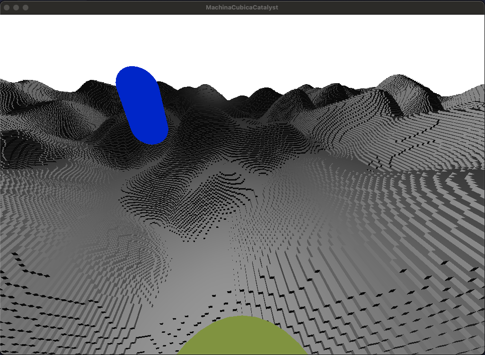

# MachinaCubicaCatalyst



**MachinaCubicaCatalyst** is a modular **Minecraft-like clone** with a strong focus on **multiplayer networking, client prediction, and efficient world handling**.  
The architecture is split into three layers:

- **Common** — core engine code (world, entities, networking, utilities).
- **Client** — local simulation, rendering, input, and prediction.
- **Server** — authoritative world state and multiplayer sync.

The project is built with [xmake](https://xmake.io), using clang-format/clang-tidy for consistency.

---

## Current Features

### World & Terrain
- Chunked block world — chunks stored as **palette + bitarray** in runtime memory.
- Procedural terrain — generated with **Perlin noise** (basic heightmap).
- Async chunk meshing — meshing tasks offloaded to a thread pool.
- Face culling in meshing — only visible block faces are meshed.

### Networking
- Client–server architecture with clear separation of responsibilities.
- Strongly typed packets with serialization via `PacketStream`.
- Compression:
    - All packets → compressed with **zlib**.
    - Chunk packets → stored as palette + bitarray, compressed with **RLE**, then passed through **zlib**.
- Event-driven flow via `Event` and `EventManager`.

### Client Prediction
- Basic interpolation with a 50ms delay for smoother client experience.
- Keeps client state responsive while syncing with the server.

### Utilities
- Logging & Assertions — integrated for debugging.
- Benchmarking — macros for lightweight profiling of hot paths.

---

## Planned Features / Roadmap
- World generation:
    - More advanced terrain features.
    - Infinite world generation.
- Blocks:
    - More block types.
    - Block interaction system.
- Lighting:
    - Improved and more realistic lighting model.
- Meshing:
    - Greedy meshing for fewer vertices and improved performance.
- World display:
    - Adaptive chunk display based on player position (LOD / view distance).
- Networking:
    - More advanced client prediction and reconciliation.
    - Area-of-interest filtering — only send chunk/entity updates to nearby players.

---

## Architecture Highlights
- Event-driven — decoupled internal and network communication.
- Performance-oriented — inline `.inl` hot paths, async chunk meshing, layered compression.
- Maintainable — modular structure (`Common`, `Client`, `Server`), consistent tooling.
- Scalable — designed for extending world generation, ECS gameplay, and networking.

---

## Build Instructions
1. Clone the repo:
   ```bash
   git clone https://github.com/yourusername/MachinaCubicaCatalyst.git
   cd MachinaCubicaCatalyst
   ```
2. Configure and build:
   ```bash
   xmake f -m <debug|release>
   xmake
   ```
3. Run targets:
   ```bash
   xmake run Server
   xmake run Client -p "port" -h "host"
   ```

